# BHCIS---Barangay-Health-Center-Information-System
A streamlined system designed for local Barangay Health Centers to automate information gathering, patient records management, and daily health service operations. It improves efficiency, reduces manual work, and ensures accurate, accessible health data for better community healthcare delivery.

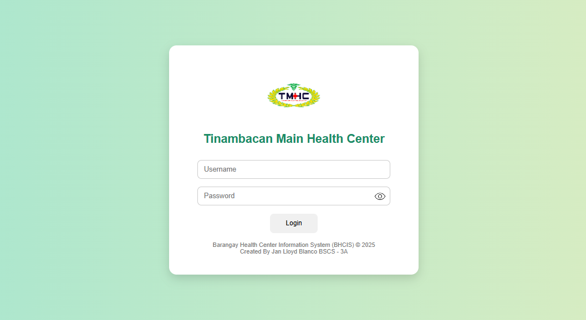
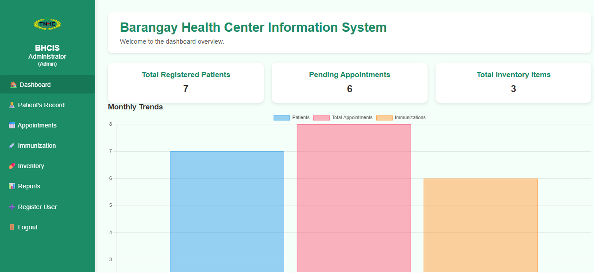
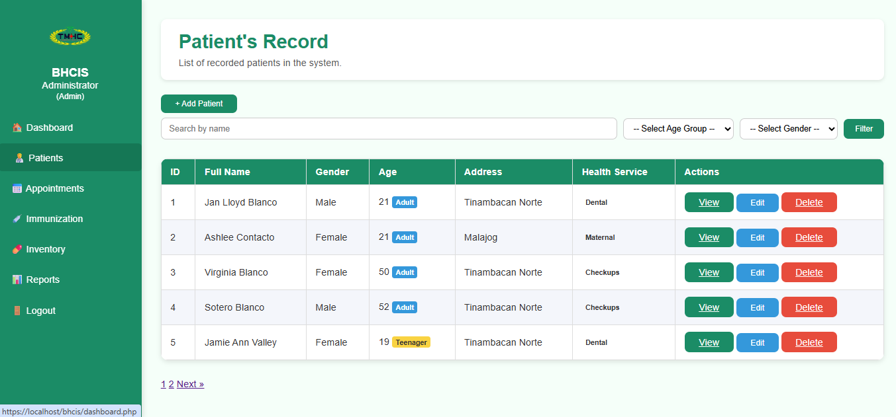
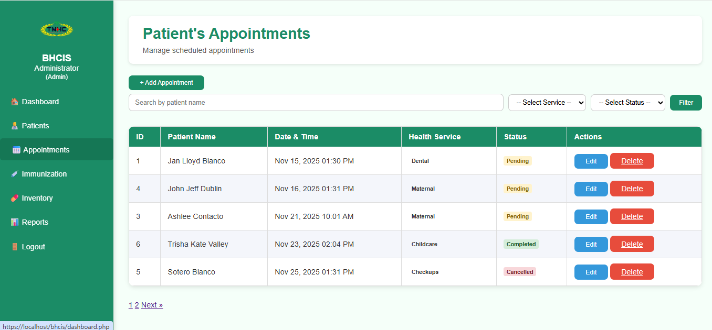
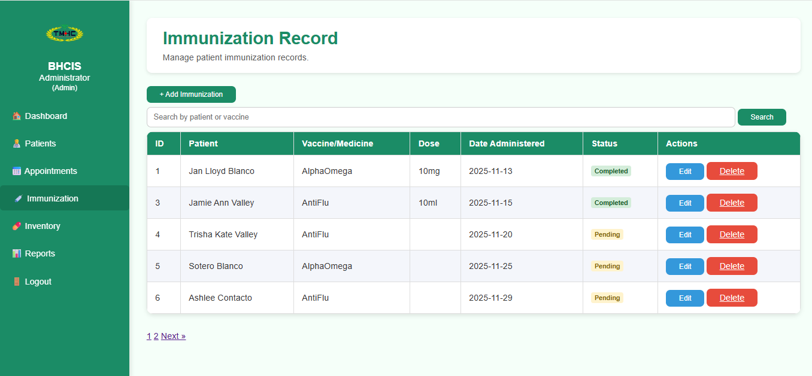
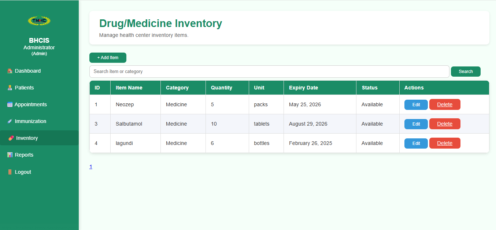
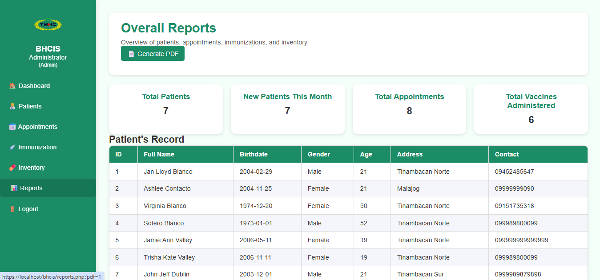
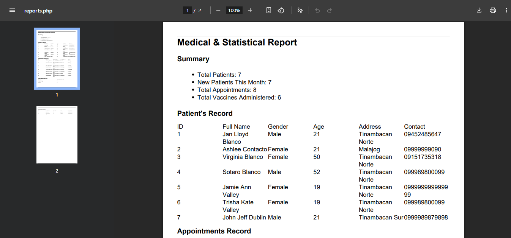
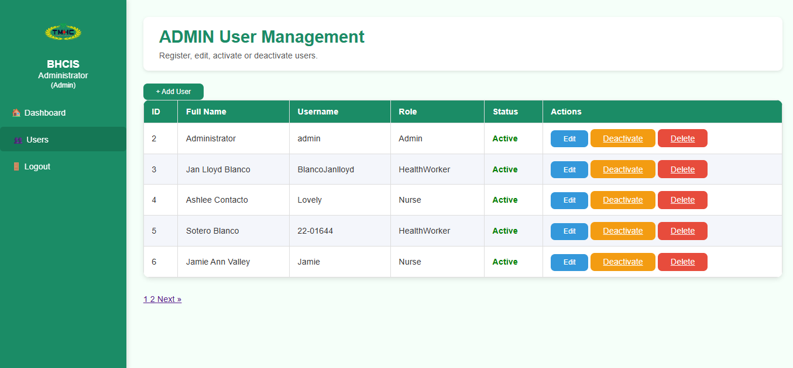

  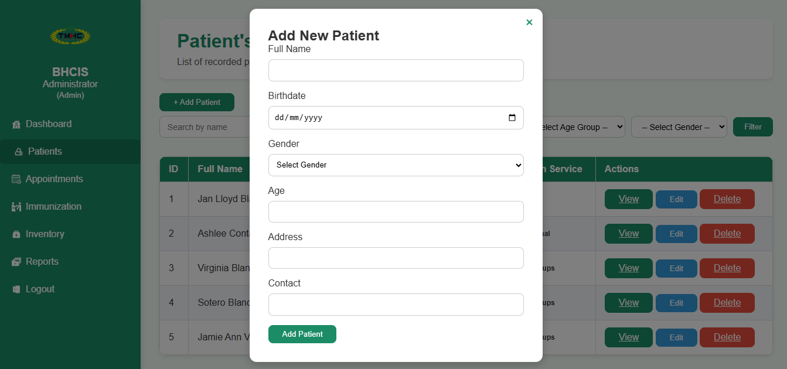
  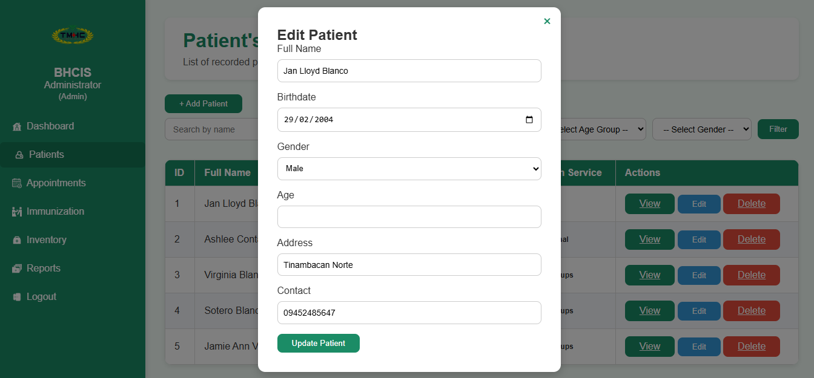
  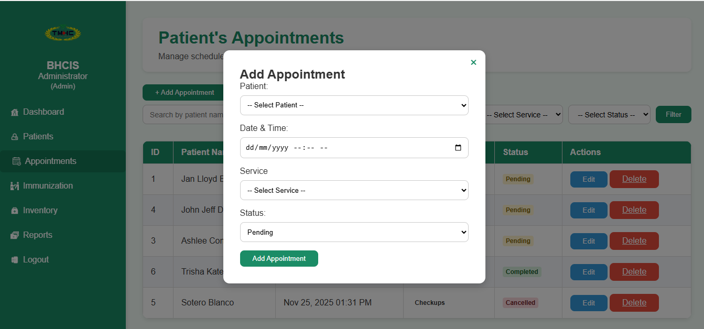
  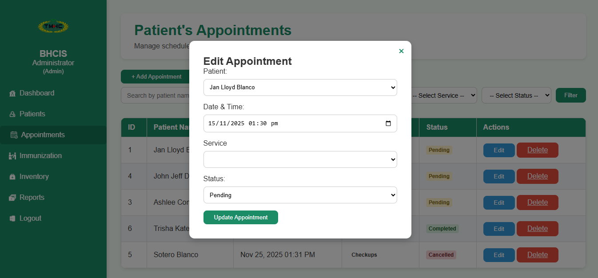
  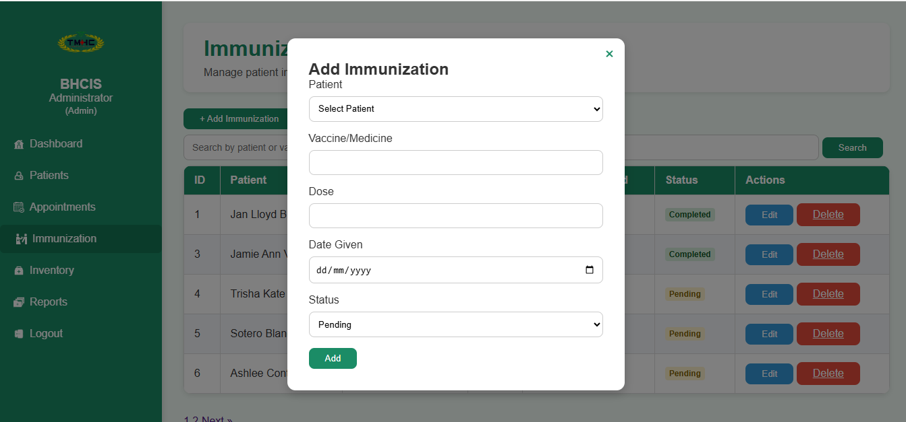
  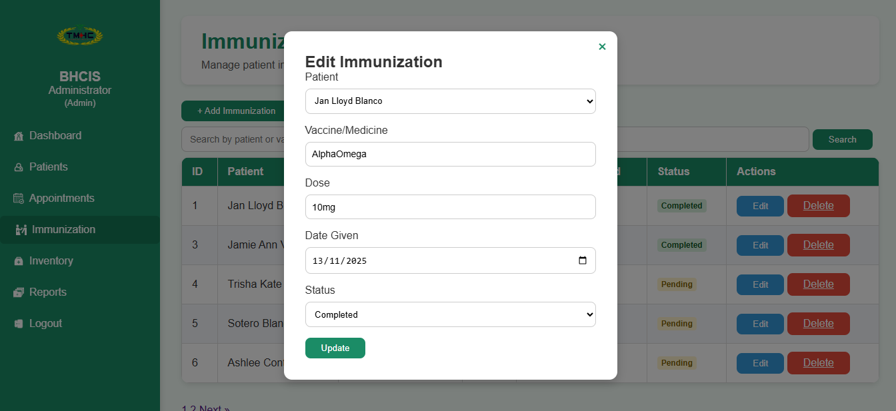
  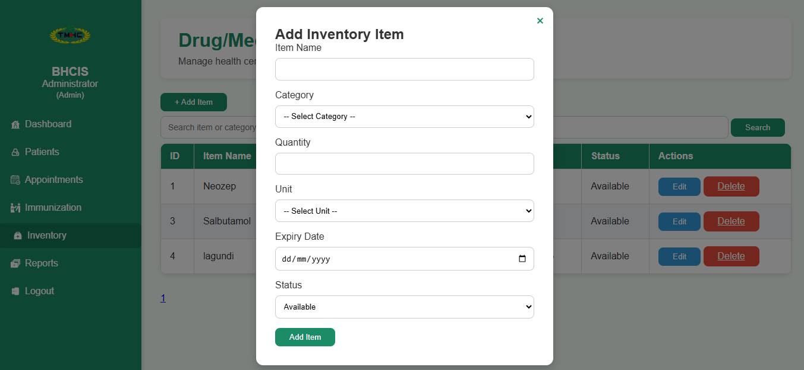
  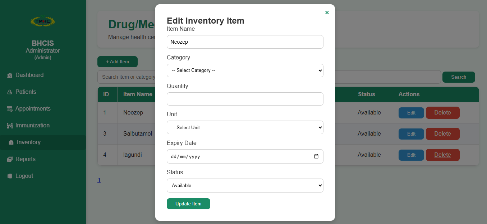

